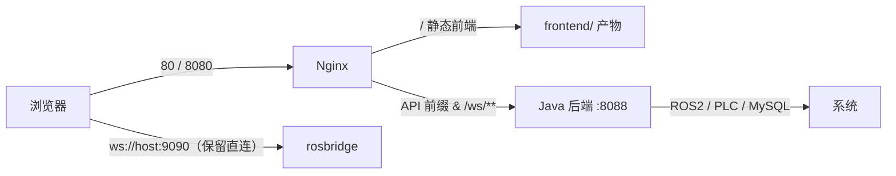

# Web 前后端分离架构设计（方案稿 v1）

> 状态：**P0 物理外置已实施（2026-09-16，过渡模式：`static-locations`）**；Nginx 站点待现场确认（v1.1：目录结构 `web/{backend,frontend,tools,deploy}` + `web/` 级数据占位）。配套 skill：`~/.agents/skills/blueant-web-separation/SKILL.md`。
> 基准约束：不改 ROS 话题契约（见 `PATH_ALIGNMENT_PLAN.md`）；离线现场可交付（`web/deploy/no_network_packages`）。
> 部署主目录约定：**不固定目录** —— 交付包可解压到任意路径（`ROBOT_APP_DIR`；源码模式脚本自定位，deb 模式前缀可配置，默认 `/opt/blueant/robot`）。

---

## 1. 现状（单体形态，已盘点核对）

| 项 | 事实 |
|---|---|
| 后端 | Spring Boot 3.2.2 / JDK 17；`server.port: ${ROBOT_WEB_PORT:8088}` |
| 前端 | 随 jar 打包：`src/main/resources/static`（多页面：`index.html`、`login.html`、`select-printer.html` + `src/components/*` 12 个模块）；原生 JS + three.js / leaflet / roslibjs 等 |
| REST 域 | 20 个 `@RestController`：`ccpp`、`data-admin`、`data-transfer`、`files`、`/api`、`log`、`order`、`param`、`pcd`、`pgm`、`/ros2`、`route`、`carLog`、`sensor`、`station`、`system`（SystemController / SystemConfigController）、`task`、`user`、`waterdepth`（另有 `Llh2xyz/Revdata/SendToPlc` 等文件） |
| 业务 WebSocket | Spring `@EnableWebSocket`，端点 `/ws/{sid}`（`TextWebSocketHandler`，origin `*`）；前端示例：`ws://<host>:8088/ws/control`（`machine_control.js`） |
| ROS Bridge | 浏览器直连 `ws://<host>:9090`（`ROBOT_ROSBRIDGE_URL` 或 localStorage `rosbridgeUrl` 覆盖） |
| 认证 | `JwtInterceptor` 已注册但 `.excludePathPatterns("/**")` —— **当前实际全放行**；登录接口 `/user/login` |
| CORS | `allowedOriginPatterns("*") + allowCredentials(true)`（已配置，分离后应随同域方案收窄） |
| 静态预览 | `8080` 端口预览默认免登录（`?skipLogin=0` 恢复登录流程）；`static/websocket-server.js`（Node, 8089）为开发自测工具，不属生产链路 |
| 既有打包思路 | `static/jar-packaging-guide.md`：frontend-maven-plugin 将 `dist/` 打进 jar —— 分离即"反向操作"：让静态目录独立部署 |
| 部署形态 | 源码模式（`ros2.sh` / `deploy/` 脚本）与 systemd（`robot-system.service`）二选一；deb 打包在 `tools/web_deb_packaging` |

**已知会阻碍分离的细节（先记下，迁移时逐一处理）**：

1. 个别前端模块以 `当前 hostname:8088` 拼绝对地址（`machine_control.js` 的 `/ws/control`、`area-traversal.html`、`ApiManager.js` 注释样例）→ P1/P2 起统一改"同源相对路径 + 可配置 base"。
2. 前端 REST 默认跟随当前网页主机与端口 → 天然适配"同域反代"方案（不需要改前端即可先分离）。
3. `static/package.json`、`websocket-server.js(8089)` 是开发工具链残留，与生产无关，P3 归类/清理。

**（已完成）运行路径占位**：`pcd/`、`maps/`、`logs/`、`runtime/{files,static-maps,logs,run}/` 的 `.gitkeep` 已随 2026-09-15 分层重构**上移至 `web/` 根**（单一来源，不保留两套）；`.gitignore` 为"忽略内容、保留占位"（`pcd/*` + `!pcd/.gitkeep` 等）。运行时行为不变。

---

## 2. 目标与原则

目标：前端与后端**物理分离** —— 独立构建、独立部署；后端只提供 API / WS / 文件服务；前端只依赖同源相对路径。

原则：

1. **不改 ROS 话题契约**，不动导航栈拓扑与部署脚本的导航职责；
2. **同域反代优先**（Nginx 同源：无跨域、无 Cookie SameSite 复杂度；CORS 可整体收窄）；
3. **每期独立可回滚**；P0 前端 0 代码改动；
4. **离线可交付**：新增依赖必须可离线（进 `deploy/no_network_packages` 或系统包）。

---

## 3. 目标架构



- 前端请求全部走**同源相对路径**（`/ros2/...`、`/pcd/...`、`/ws/{sid}`），由 Nginx 转发 8088；
- rosbridge 直连保留（现场网络可达 `9090`；跨机部署加防火墙白名单）；
- Nginx 承担：静态托管、gzip、缓存头、WebSocket upgrade、反代。

端口规划：

| 端口 | 用途 | 变更 |
|---|---|---|
| 80 | 前端静态（推荐） | 新增 |
| 8080 | 静态预览（现状延续） | 保持 |
| 8088 | 后端 API/WS | 不变 |
| 9090 | rosbridge | 不变（直连） |
| 8089 | Node 自测 WS（开发工具） | 非生产 |

---

## 4. 工程与目录规划（目标结构：web/{backend,frontend,tools,deploy} + 数据占位）

```
web/                              # Web 产品根（= 部署根 ROBOT_APP_DIR 的源码镜像；路径任意）
├── backend/                      # Java 后端（原 lyagv_base_web 主体；2026-09-15 重构就位）
│   ├── pom.xml · src/main/java/  # controller · service · mapper · websocket · ROS2 桥
│   ├── src/main/resources/       # application.yml · mapper/ · logback.xml（static/ 已外迁）
│   ├── sql/ · doc/
├── frontend/                     # 前端（原 static/ 原样外置）
│   ├── index.html · login.html · select-printer.html
│   ├── src/{api,components,modules,…}
│   └── （P1：package.json + Vite）
├── tools/                        # 其他调用工具（非运行主链路）
│   ├── ros2.sh（现场入口）· shutdown_ros2_nodes.sh
│   └── web_deb_packaging/（deb 打包；旧脚本已清理 2026-09-16）
├── deploy/                       # 部署与运维（安装/启停/导航栈/离线包；可并入 tools/）
│   ├── install*.sh · start/stop/check-navigation.sh · inspect-*.sh
│   ├── run-java.sh · robot.env.example · db/ · no_network_packages/
│   └── nginx/（P0 新增 web-ui.conf 示例）
├── pcd/      （.gitkeep）        # 运行数据占位（部署时映射 <ROBOT_APP_DIR>/pcd）
├── maps/     （.gitkeep）        # （部署时映射 <ROBOT_APP_DIR>/maps）
├── logs/     （.gitkeep）
└── runtime/  （.gitkeep：files/ static-maps/ logs/ run/）
```

- **P0**：不建前端工程；`backend/src/main/resources/static/` 内容**原样平移** `web/frontend/`；jar 不再打包前端。**（已实施 2026-09-16）**：外置 319 文件；serving=过渡模式 `spring.web.resources.static-locations=file:${ROBOT_WEB_UI_DIR:${user.dir}/../frontend}/`；`ROBOT_WEB_UI_DIR` 由 run-java.sh（源码=<部署根>/frontend）与 deb start.sh（=<安装根>/web-ui）导出；deb stage 增 `web-ui/`。
- 部署目标目录：`$ROBOT_WEB_UI_DIR`（默认 `$ROBOT_APP_DIR/web-ui`）；运行布局不变（`$ROBOT_APP_DIR/{pcd,maps,runtime,logs}` + jar）。
- 过渡兼容开关（**已启用**）：`spring.web.resources.static-locations=file:${ROBOT_WEB_UI_DIR:...}/`。
- **重构执行记录（2026-09-15 已实施）**：
  1. 嵌套仓库边界：原 `web/lyagv_base_web` 独立 Git 子仓库的 `.git/.gitignore/.gitattributes` 已上移 → **`web/` 即 Web 产品仓库根**（backend/tools/deploy 等同仓；Git 索引表现为 rename+add，待该子仓库单独提交）。
  2. 已同步引用：`deploy/run-java.sh`（`$APP_DIR/backend/pom.xml`、`cd "$APP_DIR/backend"`）、`tools/ros2.sh`/`tools/start.sh`（config 回退与 pom 检查指向 `backend/`）、`tools/web_deb_packaging/config/web_packages.conf`（`WEB_ROOT` + `WEB_SRC_DIR=${WEB_ROOT}/backend`）、`.gitignore`、`README.md`/`UPDATE_GUIDE.md`/`tools/web_deb_packaging/README.md` 路径示例。
  3. 占位：`web/{pcd,maps,logs,runtime}` 已上移（单一来源）。
  4. 尚未执行：`frontend/` 外置（`backend/src/main/resources/static/` 平移）与 Nginx 站点 / `static-locations` 过渡开关（待"现场 Nginx 可获得性"决策）；deb 打包链路需在 Ubuntu 回归验证。

---

## 5. 接口契约（向后兼容策略）

- **前缀策略**：P0–P2 **保留全部现有前缀**（Nginx 按前缀反代：`/user /ros2 /pcd /pgm /route /task /order /station /sensor /waterdepth /ccpp /data-admin /data-transfer /files /log /carLog /param /system /api`）；P3 再评估收敛 `/api/v1`（前端同步 + 反代兜底）。
- **响应 envelope**：沿用 `ResultUtils`（`code/message/data`）；补一份统一错误码表。
- **契约文档**：P3 引入 `springdoc-openapi`（离线包）生成 OpenAPI JSON，作为前端联调与 mock 依据。
- **业务 WS 契约**：端点 `/ws/{sid}`；把既有消息类型整理成表（`control` 等）；心跳保活；分离后补鉴权（见 §6）。

---

## 6. 认证与安全（分离后收紧）

| 项 | 现状 | 分离后（同域）建议 |
|---|---|---|
| JWT 拦截 | 全放行（`excludePathPatterns("/**")`） | 分阶段重开：拦截 `/**`，白名单 `/user/login`、`/ws/**`、静态预览页；先灰度防误伤现场 |
| CORS | `* + credentials` | 同域反代后**删除/收窄**（改为仅允许本机/网关源） |
| WS 鉴权 | 无 | sid 或首帧 token 校验（P2） |
| 预览免登录 | 仅限本机测试用途 | 生产仅经 Nginx；预览服务只绑定本机 |

---

## 7. 静态资源与地图文件访问

- `/pcd/*`、`/pgm/*` 等文件读取**仍由后端处理**（既有校验/白名单逻辑不动）；Nginx 只反代，不直接暴露磁盘目录；
- 前端加载的大文件（点云/栅格图）建议 Nginx 开 gzip + 长缓存（内容路径不变）。

---

## 8. 迁移路线（每期可独立回滚）

| 期 | 动作 | 涉及位置 | 验收 | 回滚 |
|---|---|---|---|---|
| **P0 物理外置**（前端 0 代码改动；已实施 2026-09-16，过渡模式） | `static/` 平移 `web/frontend/`；新增 Nginx site（静态 + 反代）；jar 不再打包前端（调试期可挂 `static-locations`） | `backend/src/main/resources/static/**`；新增 `deploy/nginx/web-ui.conf` 示例 | 80/8080 打开 UI；登录、全部页面、REST、`/ws/control`、rosbridge 直连全通 | UI 拷回 `static/`，Nginx 下线 |
| **P1 前端工程化** | 以 `web/frontend/` 初始化 Vite（**先多页原样，零重写**）；dev proxy（`/ws`、各 API 前缀 → `127.0.0.1:8088`）；`base:'./'`；npm 依赖离线化 | `web/frontend/**`；`deploy/no_network_packages` | `npm run build` 产物与 P0 功能一致；Vite dev 直连后端 | 保留旧产物目录，切回 |
| **P2 渐进 SPA** | 建议 Vue3：优先 `indoor-map → process-map → pcd-loader` 逐页迁移；统一 `window.APP_CONFIG`（相对路径），消除硬编码 `8088` | 同上 + 少量页面文件 | 迁移页功能对拍（PCD 流程、室内图、控制） | 单页级回滚（跳回旧页） |
| **P3 契约治理** | OpenAPI、错误码冻结、mock、CI（构建 + lint）；评估 `/api/v1` 收敛与开发工具（8089 等）清理 | 后端 + 前端 | 契约测试通过 | 反代保留旧前缀双跑 |

---

## 9. 部署与运维变化

- `robot.env`：新增 `ROBOT_WEB_UI_DIR`（默认 `$ROBOT_APP_DIR/web-ui`）、Nginx 站点配置项；
- 源码模式：`deploy/` 脚本增加"同步 web-ui + reload nginx"（`run-java.sh` 不变，仍 8088）；
- deb 模式：`web/tools/web_deb_packaging` 拆出 `web-ui` 包（nginx conf + 静态文件），Java 包移除静态资源；
- 防火墙：局域网放行 80、8088、9090（后两者现状）；8080 仅本机。

---

## 10. 风险与待确认（决策点）

1. **现场 Nginx 可获得性**：需离线可装件或改用已有组件（决定 P0 是否先用 `static-locations` 兼容模式过渡）；
2. **前端框架选型**：建议 Vue3；若求零风险可长期维持"原生多页 + Vite 打包"；
3. **API 前缀收敛时机**（P3，可无限延后，不阻塞）；
4. **rosbridge 是否改由后端代理**：当前**不改**（保留直连；跨机部署依赖网络可达）；
5. 多页/SPA 混合期深链与相对路径问题（`base:'./'` + 目录层级需核对）；
6. 开发工具链（`websocket-server.js(8089)`、`package.json`）的归类与清理；
7. **目录分层重构**（`web/{backend,frontend,tools,deploy}` + `web/` 级占位）：一次性执行并同步全部引用（脚本/systemd/文档/技能），避免中间态。

---

## 11. 验证清单（P0 用）

```bash
# 静态前端（Nginx）
curl -s -o /dev/null -w 'HTTP %{http_code}\n' http://<host>/
# API 反代
curl -s -o /dev/null -w 'HTTP %{http_code}\n' http://<host>/ros2/status      # 换实际存在的只读接口
# 业务 WS（浏览器控制台或 wscat）
wscat -c ws://<host>/ws/control
# rosbridge 直连
python3 - <<'PY'  # 或直接用页面功能验证
PY
# 端口
ss -tlnp | grep -E ':80|:8080|:8088|:9090'
```

> 备注：占位目录（`.gitkeep`）不参与上述任何行为；`pcd/`、`maps/` 的运行语义仍以 `PATH_ALIGNMENT_PLAN.md` 的路径契约为准。
